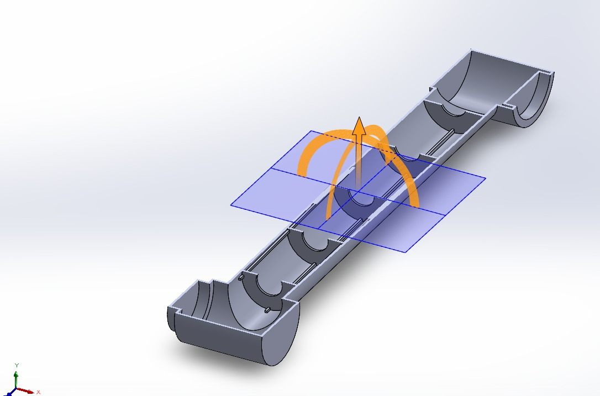
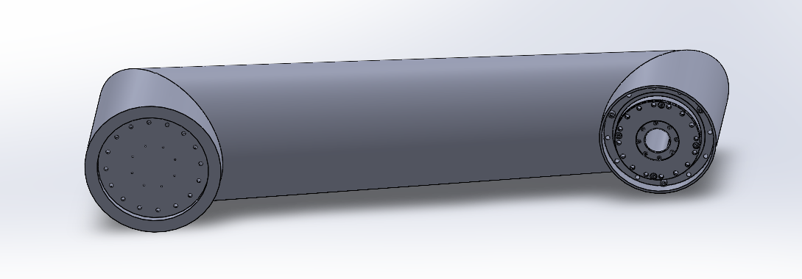
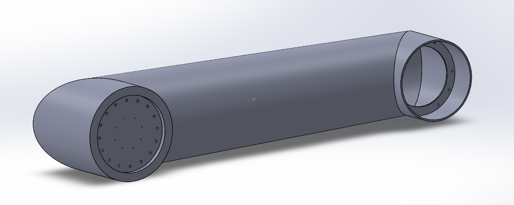
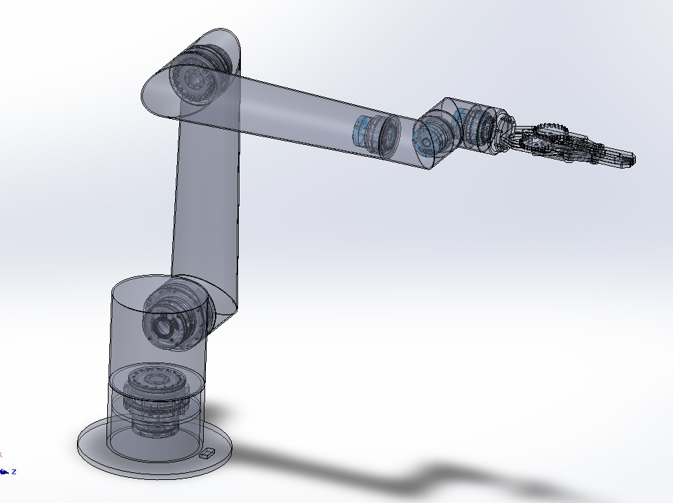

<div align="center">

# 6DOF Robot Arm — ROS 2

### Mechanical design → actuator sizing → FEA → URDF → simulation → control → sequence programming → autonomous jig placement

[](https://docs.ros.org/en/humble/)
[](https://ubuntu.com/)
[](https://classic.gazebosim.org/)
[](https://moveit.picknik.ai/)
[](https://www.python.org/)
[](https://github.com/Yousef-Elbeltagy/6DOF-Robot-Arm-ROS2/actions/workflows/quality-checks.yml)


**A 6-axis robot arm developed from SolidWorks CAD into a complete ROS 2 simulation, programming, and autonomous jig-placement system.**

**[Quick Start](QUICKSTART.md) · [Documentation](docs/README.md) · [CAD Files](cad/README.md) · [Roadmap](ROADMAP.md) · [Changelog](CHANGELOG.md)**

</div>

---

## Project at a glance

| | |
|---|---|
| **Robot** | 6-DOF articulated arm + custom gripper |
| **Design target** | ~1.5 m reach, ~10 kg payload |
| **Mechanical CAD** | SolidWorks native source + STEP interoperability exports |
| **Main structure** | 6061-T6 aluminum |
| **Robot model** | URDF + STL meshes |
| **Robotics stack** | ROS 2 Humble, MoveIt 2, RViz 2, ros2_control |
| **Simulation** | Gazebo Classic 11 |
| **Control application** | Custom Python/Tkinter GUI |
| **Programming** | Saved poses, PTP/LIN sequences, blending, digital I/O, gripper actions |
| **Autonomy** | Runtime IK, dynamic TF targets, full-table jig placement |
| **Public validation** | Environment check, clean public build, and full simulation launch verified |
| **Development context** | Robotics / Mechatronics internship project |

> The final system is a **simulation-validated engineering prototype**. The physical six-axis arm was not fully commissioned during the project period because the selected integrated joint modules had a long procurement lead time.

---

## Why this project exists

Wire-harness production can depend on dedicated boards and fixed jig layouts for each product or variant. That creates slow changeovers, storage overhead, and limited flexibility when layouts change.

The concept explored here is a reusable workboard with modular jigs. Instead of rebuilding a board, the robot selects the correct jig from a source table and places it at the required target position automatically.

The long-term vision is a flexible cell where a camera reads a harness layout, identifies placement targets, and the robot configures the board automatically.

---

# Development workflow

```text
1. Mechanical architecture & CAD
             ↓
2. Torque calculation & actuator selection
             ↓
3. FEA / stiffness / manufacturability
             ↓
4. CAD → URDF conversion
             ↓
5. Gazebo + MoveIt 2 + RViz validation
             ↓
6. ros2_control integration
             ↓
7. Custom operator interface
             ↓
8. Saved poses & sequence programming
             ↓
9. Automatic jig placement
             ↓
10. Full-table autonomous simulation
```

The README follows that same order below.

---

# 1. Mechanical Design

The project started as a full mechanical robot-arm design in SolidWorks. The early work focused on the overall 6-axis architecture, cylindrical links, joint interfaces, actuator packaging, gripper integration, manufacturability, and assembly feasibility.


<table>
  <tr>
    <td align="center" width="50%">
      <br>
      <sub><b>Early internal structural concept</b><br>Initial support/rib exploration and joint reference geometry.</sub>
    </td>
    <td align="center" width="50%">
      <br>
      <sub><b>Cylindrical link shell</b><br>External link geometry and end-interface packaging.</sub>
    </td>
  </tr>
  <tr>
    <td align="center" width="50%">
      <br>
      <sub><b>Joint-side CAD view</b><br>Flange, mounting-hole, and actuator-interface development.</sub>
    </td>
    <td align="center" width="50%">
      <br>
      <sub><b>Transparent full-arm assembly</b><br>Internal packaging of joints, drives, wrist, and gripper.</sub>
    </td>
  </tr>
</table>

### Mechanical evolution

- 6-DOF articulated architecture with cylindrical links.
- Hollow aluminum structure to reduce moving mass.
- Early internal-rib concepts were explored, then removed from the final manufacturing direction because of fabrication complexity.
- Final link strategy used simpler unribbed shells with wall thickness, geometry, local reinforcement, housings, and smooth transitions carrying the structural load.
- Custom cycloidal and planetary/belt reduction concepts were studied before integrated joint modules became the final actuator direction.

➡️ **[Mechanical design details](docs/MECHANICAL_DESIGN.md)**  
➡️ **[Native SolidWorks + STEP CAD packages](cad/README.md)**

---

# 2. Torque Calculation & Actuator Selection

The next step was determining the joint loads and selecting actuators capable of handling the arm, wrist, gripper, and payload.

### Dynamic joint torque results

| Joint | Peak torque |
|---|---:|
| J1 | 115.58 N·m |
| **J2** | **411.90 N·m** |
| J3 | 182.49 N·m |
| J4 | 35.64 N·m |
| J5 | 15.50 N·m |
| J6 | 5.10 N·m |

J2 became the governing axis because it carries the downstream links, wrist, gripper, and payload.

### Final integrated actuator concept

| Joint(s) | Module | Rated torque | Peak/start-stop torque |
|---|---|---:|---:|
| J1-J2 | TD-110-170 | 328 N·m | 702 N·m |
| J3 | TD-100-142 | 169 N·m | 411 N·m |
| J4-J6 | TD-70-90 | 50 N·m | 102 N·m |

The final concept used integrated servo/reducer modules rather than continuing with a custom gearbox for every joint. This reduced gearbox-development risk and simplified packaging around the major axes.

---

# 3. Structural Analysis & FEA

Strength alone was not enough; stiffness and local stress concentration also mattered because end-effector deflection directly affects positioning accuracy.


Important findings included:

- one representative study produced approximately **105 MPa** maximum stress against a 6061-T6 yield strength of approximately **275 MPa**, giving a factor of safety of about **2.6**,
- later local analysis around a J2 transition showed a much higher peak at a sharp geometric transition, identifying a stress-concentration problem rather than a uniformly overloaded link,
- global displacement studies showed that the robot could remain below yield while still being too flexible for accurate positioning,
- the long links and forearm became major stiffness drivers, leading to thickness and geometry iterations.

These results drove smoother transitions, local reinforcement, and a stronger focus on stiffness rather than only yield strength.

---

# 4. CAD → URDF → ROS 2

Once the mechanical model was stable enough, the SolidWorks assembly was prepared for ROS 2.

The export workflow included:

- parent/child link hierarchy,
- revolute joint axes,
- coordinate systems and joint origins,
- mass and center of mass,
- inertia tensors,
- motion limits,
- visual STL meshes,
- collision geometry,
- gripper mimic relationships.


The SolidWorks assembly pose became the zero/home reference for the URDF model, with joint names standardized as `joint_1` through `joint_6`.

---

# 5. Simulation & Motion Planning

The exported robot was then integrated into the ROS 2 simulation stack and validated before higher-level automation was added.

<table>
<tr>
<td width="50%"></td>
<td width="50%"></td>
</tr>
<tr>
<td align="center"><b>Gazebo Classic 11</b></td>
<td align="center"><b>MoveIt 2 + RViz 2</b></td>
</tr>
</table>

### Simulation stack

| Layer | Technology |
|---|---|
| Operating system | Ubuntu 22.04 LTS |
| Middleware | ROS 2 Humble |
| Physics simulation | Gazebo Classic 11 |
| Motion planning | MoveIt 2 |
| Planning pipelines | OMPL + Pilz |
| Visualization | RViz 2 |
| Control | ros2_control + ros2_controllers |
| Build | colcon / ament |

MoveIt 2 handled IK, planning, collision checking, and trajectory generation. Gazebo provided the workcell physics and robot execution environment, while RViz was used to validate planning-scene and robot-state behavior.

➡️ **[Software architecture](docs/SOFTWARE_ARCHITECTURE.md)**

---

# 6. ros2_control & Robot Execution

The arm controller was integrated through `ros2_control` using trajectory actions for the six arm joints and a separate trajectory controller for the gripper.

Important execution interfaces include:

```text
/arm_controller/follow_joint_trajectory
/gripper_controller/follow_joint_trajectory
/sequence_move_group
```

This layer turned MoveIt plans into actual simulated robot motion and became the foundation for both the operator GUI and the later automatic placement system.

---

# 7. Main Operator Interface

After the robot could plan and execute reliably, a custom Python/Tkinter application was built around it.

<p align="center">
  
</p>

The interface provides:

- Cartesian X/Y/Z jogging,
- Roll/Pitch/Yaw jogging,
- joint jogging,
- speed override,
- WORLD / FLANGE / TOOL jog frames,
- configurable Tool Center Point,
- current and target TCP pose display,
- gripper open/close,
- six digital inputs,
- six digital outputs,
- saved robot poses,
- access to the Sequence Controller,
- access to Automatic Jig Placement,
- live application status.

This was the point where the project moved from a robotics stack controlled mainly through ROS tools into a usable operator-facing application.

---

# 8. Sequence Programming

The **Sequence Controller** was built after manual control and saved poses were working. It turns taught poses into ordered robot programs with motion behavior, process logic, I/O, and gripper synchronization.

<p align="center">
  
</p>

Each program row can define:

| Sequence field | Options / behavior |
|---|---|
| **Waypoint** | Any saved robot pose |
| **Behavior** | `STOP` / `CONTINUE` |
| **Blend Radius** | Configurable transition radius |
| **Motion** | `PTP` / `LIN` |
| **Input Source** | `NONE`, `IN 1` … `IN 6` |
| **Input State** | `TRUE` / `FALSE` |
| **Input Timing** | `BEFORE` / `AFTER` |
| **Output Action** | `NONE`, `OUT 1` … `OUT 6`, `OPEN GRIPPER`, `CLOSE GRIPPER` |
| **Output State** | `TRUE` / `FALSE` where applicable |
| **Output Timing** | `BEFORE` / `AFTER` |

Example logic:

```text
IF IN 1 == TRUE BEFORE PICK → move → CLOSE GRIPPER AFTER
IF IN 2 == FALSE BEFORE MID → set OUT 1 = TRUE BEFORE
IF IN 3 == TRUE AFTER PLACE → OPEN GRIPPER AFTER
HOME → final safe stop
```

### Gripper synchronization

The arm is not allowed to continue while the gripper is still moving:

```text
arm motion segment
      ↓
stop at gripper waypoint
      ↓
send gripper FollowJointTrajectory goal
      ↓
wait for the real controller result
      ↓
continue next arm segment
```

### STOP / RESUME

STOP cancels both the active MoveIt sequence goal and the active arm-controller trajectory. RESUME retries the interrupted step from the robot's current state.

The sequence work also exposed and drove fixes for motion types being unintentionally forced to PTP, duplicate `move_group` processes, LIN/Pilz start-state constraints, stale gripper feedback, asynchronous action-result handling, and gripper synchronization.

➡️ **[Read the full Sequence Programming & Execution documentation](docs/SEQUENCE_PROGRAMMING.md)**

---

# 9. Automatic Jig Placement

The final major software layer was the autonomous jig-placement system. It combines target discovery, jig matching, runtime IK, robot motion, simulated grasping, placement validation, and repeatable full-table execution.

<p align="center">
  
</p>

### Target discovery & jig matching

The interface discovers free target frames at runtime, identifies the required jig family, and searches for an unused matching jig.

```text
L1 → LARGE jig
M1 → MEDIUM jig
M2 → MEDIUM jig
S1 → SMALL jig
```

Targets are discovered from TF frame names ending in `_target_link` instead of relying only on a fixed list of coordinates.

### Runtime IK & branch selection

For each pickup and placement pose, the controller evaluates multiple IK candidates and chooses a practical branch from the current robot state:

```text
Target TCP pose
      ↓
Generate multiple IK seeds
      ↓
Call MoveIt IK
      ↓
Collect valid solutions
      ↓
Compare wrapped joint deltas
      ↓
Penalize excessive wrist motion
      ↓
Choose the lowest-motion candidate
      ↓
Execute through the PTP path
```

### Automatic execution

```text
Discover/select free target
        ↓
Infer required jig size
        ↓
Find unused matching jig
        ↓
Move above pickup
        ↓
Descend
        ↓
Close gripper + attach jig
        ↓
Lift and transfer
        ↓
Move above target
        ↓
Descend
        ↓
Open gripper + detach
        ↓
Validate placement
        ↓
Mark jig used + target occupied
        ↓
Retract and continue
```

The GUI supports both **single-placement execution** and **FULL RUN – COMPLETE TABLE**.

Two independent state trackers prevent incorrect repeated operations:

```python
placed_jig_models
filled_placement_targets
```

`placed_jig_models` prevents reuse of a jig that has already been placed. `filled_placement_targets` prevents a second jig from being sent to an occupied target.

### Stable simulated detach

Jig grasping is simulated with the IFRA LinkAttacher plugin. A difficult Gazebo stability bug was traced to detach operations being executed directly from a ROS service callback thread. The final design queues the request and performs `Joint::Detach()` from Gazebo's update thread instead.

### Immediate STOP / RESUME

STOP cancels the active MoveIt goal and active arm-controller trajectory during automatic motion. RESUME retries the interrupted automatic step from the current robot state.

### Demonstrated in simulation

- dynamic target discovery,
- automatic jig-size inference,
- unused-jig matching,
- runtime multi-seed IK,
- wrist-aware branch selection,
- simulated pickup and attachment,
- transfer and release,
- placement validation,
- jig inventory tracking,
- target occupancy tracking,
- single-target execution,
- full-table automatic execution,
- immediate STOP / RESUME.

➡️ **[Read the full Automatic Jig Placement documentation](docs/AUTOMATIC_JIG_PLACEMENT.md)**

---

# 10. Engineering Lessons & Debugging

Some of the most valuable work came from failures rather than first-pass successes:

- custom gearbox interference and manufacturability limitations,
- local stress concentrations,
- excessive structural deflection,
- duplicate MoveIt processes,
- sequence execution bugs,
- PTP/LIN handling issues,
- stale controller/GUI state,
- gripper synchronization timing,
- poor IK branches and wrist flips,
- reused-jig inventory bugs,
- Gazebo detach-thread crashes.

Each of these problems changed the design or software architecture rather than being hidden as a one-off workaround.

➡️ **[Read the engineering lessons](docs/ENGINEERING_LESSONS.md)**

---

## Repository structure

```text
6DOF-Robot-Arm-ROS2/
├── README.md
├── QUICKSTART.md
├── CHANGELOG.md
├── ROADMAP.md
├── LICENSE
├── NOTICE
├── CONTRIBUTING.md
├── src/                         # ROS 2 source packages
├── scripts/                     # dependency, build, validation and startup helpers
├── config/                      # TCP and saved-pose configuration
├── cad/
│   ├── README.md                # CAD package map and interoperability notes
│   ├── Solidworks_Cad_models/   # native SolidWorks archives
│   └── STEP_Exports/            # neutral STEP workcell/components archive
├── assets/
│   └── screenshots/             # real CAD, simulation and GUI screenshots
└── docs/                        # engineering, setup and continuation documentation
```

---

## Getting started

The validated public baseline is **Ubuntu 22.04 + ROS 2 Humble**. The repository itself is the workspace and already contains `src/`.

```bash
cd ~
git clone https://github.com/Yousef-Elbeltagy/6DOF-Robot-Arm-ROS2.git robot_arm_ws
cd ~/robot_arm_ws

bash scripts/setup_dependencies.sh
bash scripts/build_workspace.sh

cp config/robot_arm_saved_poses.json ~/robot_arm_saved_poses.json
cp config/robot_arm_tcp_config.json ~/robot_arm_tcp_config.json

bash scripts/check_system.sh
bash scripts/start_robot.sh
```

➡️ **[Quick Start](QUICKSTART.md)**  
➡️ **[Full reproduction guide](docs/REPRODUCE_PROJECT.md)**

---

## Documentation

| Document | What it covers |
|---|---|
| [Quick Start](QUICKSTART.md) | Shortest validated path from clone to launch |
| [Documentation Index](docs/README.md) | Map of all engineering and reproduction docs |
| [Reproduce Project](docs/REPRODUCE_PROJECT.md) | Clean-machine reproduction workflow |
| [Project Story](docs/PROJECT_STORY.md) | Evolution from manufacturing problem to autonomous workcell |
| [Mechanical Design](docs/MECHANICAL_DESIGN.md) | Structure, materials, torque, reducers, actuators, FEA |
| [CAD Packages](cad/README.md) | Native SolidWorks archives and STEP interoperability exports |
| [Software Architecture](docs/SOFTWARE_ARCHITECTURE.md) | ROS 2, URDF, MoveIt, Gazebo, ros2_control, GUI |
| [Sequence Programming](docs/SEQUENCE_PROGRAMMING.md) | Waypoints, PTP/LIN, blending, I/O, gripper barriers, STOP/RESUME |
| [Automatic Jig Placement](docs/AUTOMATIC_JIG_PLACEMENT.md) | Dynamic targets, runtime IK, full run, inventory and placement logic |
| [Engineering Lessons](docs/ENGINEERING_LESSONS.md) | Problems encountered and how they changed the system |
| [Results](docs/RESULTS.md) | Demonstrated capabilities and project status |
| [Gallery](docs/GALLERY.md) | Real project screenshots |
| [Setup](docs/SETUP.md) | Detailed ROS 2 environment setup |
| [Troubleshooting](docs/TROUBLESHOOTING.md) | Build/runtime diagnosis |
| [Continue Development](docs/CONTINUE_DEVELOPMENT.md) | Safe continuation path for future developers |
| [Roadmap](ROADMAP.md) | Physical integration, vision, calibration, safety and commissioning |
| [Changelog](CHANGELOG.md) | Major public repository milestones |

---

## Current status & roadmap

### Completed / validated in simulation

- [x] 6-DOF robot CAD
- [x] torque calculation and actuator selection
- [x] structural FEA / stiffness studies
- [x] gripper CAD and URDF
- [x] Gazebo simulation
- [x] MoveIt 2 planning
- [x] RViz validation
- [x] ros2_control integration
- [x] custom Python GUI
- [x] saved poses
- [x] multi-waypoint sequence programming
- [x] STOP / CONTINUE waypoint behavior
- [x] blend radius
- [x] PTP / LIN sequence selection
- [x] digital I/O sequence logic
- [x] synchronized gripper sequence actions
- [x] runtime IK
- [x] dynamic target discovery
- [x] autonomous single placement
- [x] full-table automatic execution
- [x] immediate automatic STOP / RESUME
- [x] native SolidWorks CAD publication
- [x] neutral STEP workcell/component exports
- [x] public repository environment check
- [x] public repository build validation
- [x] public Gazebo / MoveIt / RViz / GUI launch validation

### Future work

- [ ] physical actuator integration
- [ ] EtherCAT / CAN hardware interface
- [ ] real robot calibration
- [ ] camera-based target recognition
- [ ] automatic workplane calibration
- [ ] hand-guided teaching
- [ ] physical payload/stiffness validation
- [ ] industrial electrical and safety architecture
- [ ] complete cell commissioning

➡️ **[Detailed roadmap](ROADMAP.md)**

---

## Internship context & authorship

This repository documents the robot design, ROS 2 stack, simulation, control GUI, sequence-programming system, and automatic-placement engineering work developed during a broader internship project.

The internship project involved a team and supervision; this repository focuses on the technical robotics work represented here and is presented as an educational/portfolio reference rather than as a claim that every part of the wider internship project was completed by one person.

---

## Author

**Yousef El-Beltagy**  
Robotics & Mechatronics

---

<div align="center">

### CAD. ANALYZE. SIMULATE. PLAN. PROGRAM. CONTROL. AUTOMATE.

</div>
