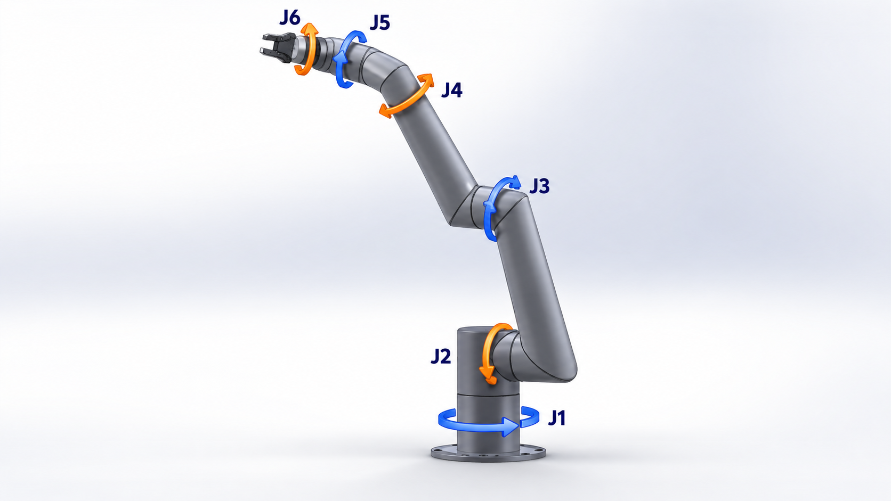
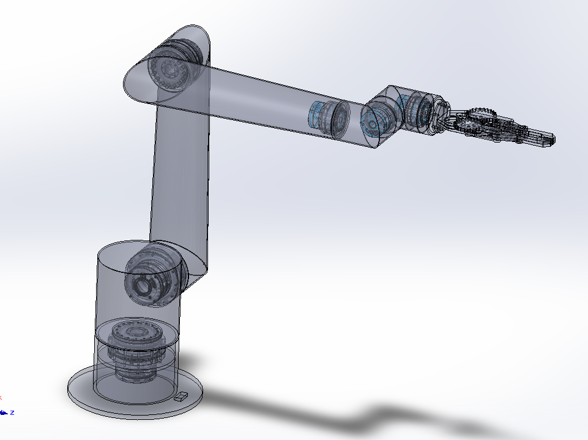
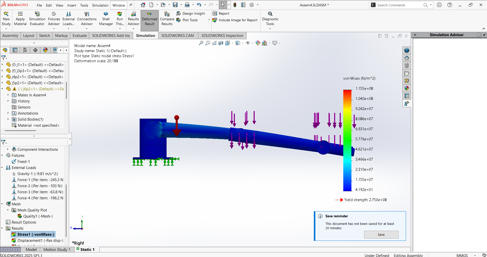
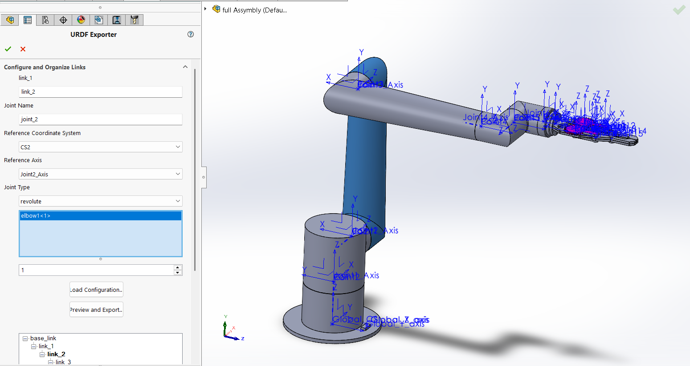
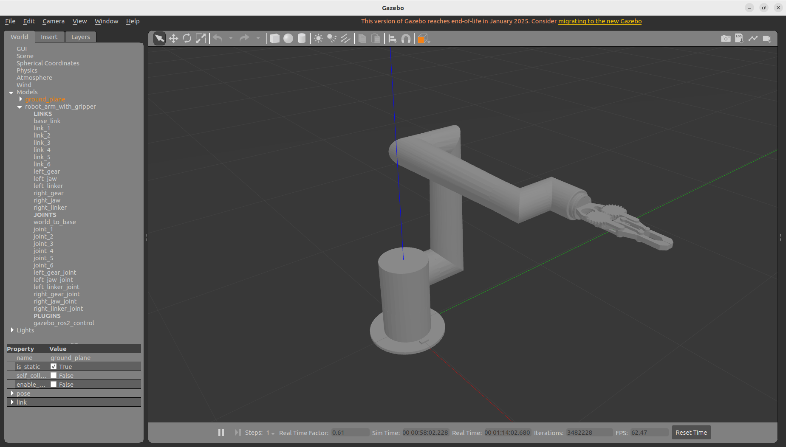
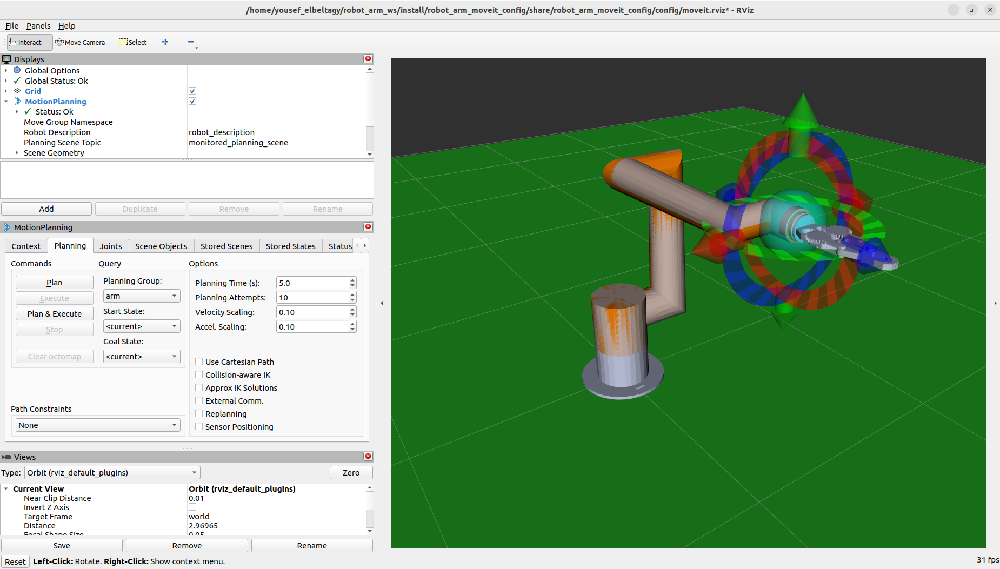
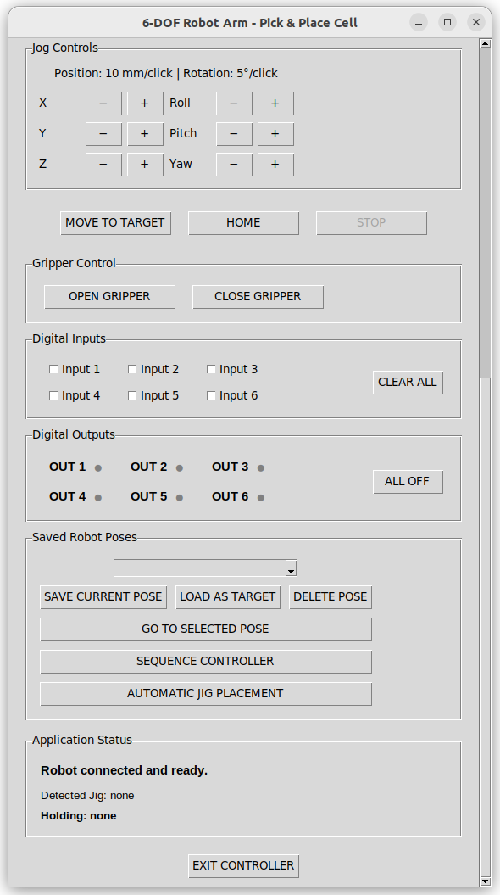
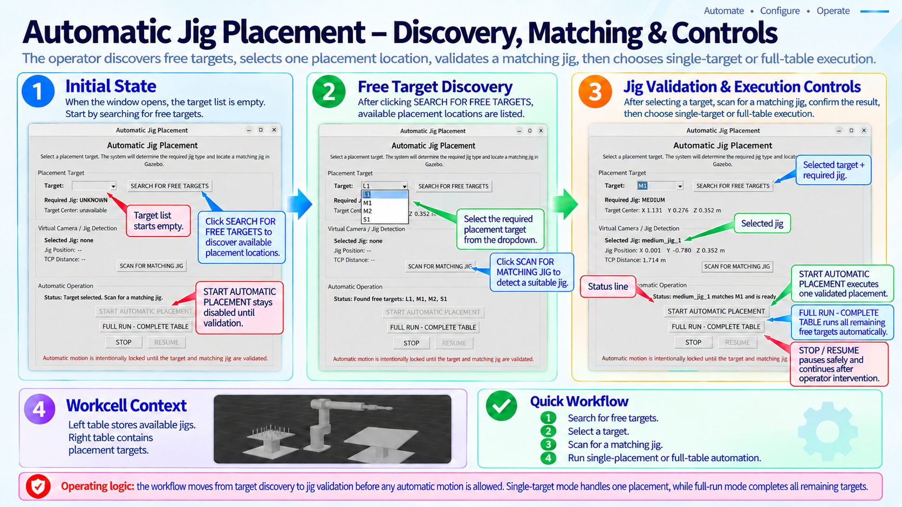

# Project Gallery

All images below are **real project screenshots/CAD/simulation captures** from the development work. AI-generated robot imagery is intentionally excluded.

---

## 1. Mechanical CAD

### Complete 6-DOF robot model



### Structural / internal design view



The mechanical design evolved through several iterations covering link geometry, joint packaging, manufacturability and stiffness.

---

## 2. Structural analysis



FEA was used not only to check stress, but also to understand stiffness, local stress concentrations and end-effector deflection.

---

## 3. CAD to URDF workflow



The SolidWorks assembly was converted into a ROS-compatible robot model with link hierarchy, revolute joints, coordinate systems, inertial properties, STL meshes and collision geometry.

---

## 4. Gazebo simulation



The complete arm and gripper were validated in Gazebo Classic 11 before adding the larger workcell and autonomous jig-placement behavior.

---

## 5. MoveIt 2 and RViz



MoveIt 2 handled inverse kinematics, planning, collision checking and trajectory generation while RViz was used to validate planning-scene and robot-state behavior.

---

## 6. Custom operator interface



The Python/Tkinter interface grew into a complete operator application with Cartesian and joint jogging, speed override, jog frames, TCP settings, saved poses, gripper control and automation tools.

---

## 7. Sequence programming


The sequence controller supports saved waypoints, STOP/CONTINUE behavior, blend radius, PTP/LIN selection, digital I/O conditions and gripper actions.

---

## 8. Automatic jig placement



The automatic-placement interface brings together target discovery, jig selection, runtime IK, simulated gripping, occupied-target tracking, full-table execution and immediate STOP/RESUME.

---

## Project progression

```text
Mechanical CAD
    ↓
FEA / torque / actuator sizing
    ↓
URDF + meshes
    ↓
Gazebo simulation
    ↓
MoveIt 2 + RViz
    ↓
Custom GUI
    ↓
Sequence controller
    ↓
Automatic jig placement
    ↓
Full-table autonomous simulation
```

---

[← Back to main README](../README.md)
